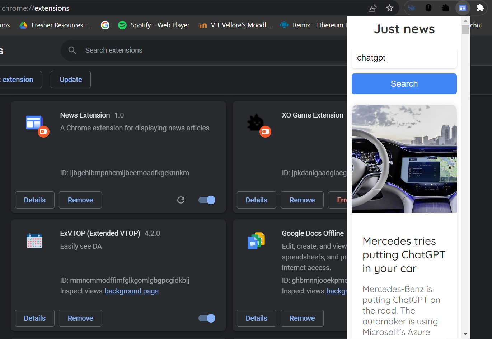

# Just News Chrome Extension

## Description
"Just News" is a Chrome extension that allows you to stay updated with the latest news articles. It fetches news data from an API and displays them in a user-friendly interface.

## Features
- Search for news articles using keywords
- Display search results in a grid layout
- Click on an article to read the full content
- Responsive design for different screen sizes

## Installation
1. Clone or download the repository.
2. Open Google Chrome and navigate to `chrome://extensions`.
3. Enable the "Developer mode" toggle at the top-right corner of the page.
4. Click on "Load unpacked" and select the folder containing the project files.
5. The "Just News" extension should now be installed and visible in the extensions toolbar.

## Usage
1. Click on the "Just News" extension icon in the toolbar to open the news interface.
2. Enter a search query in the search bar and click the "Search" button or press Enter.
3. The news articles matching the search query will be displayed in a grid layout.
4. Click on an article to read the full content in a new tab.

## Technologies Used
- HTML
- CSS
- JavaScript
- Axios (for API requests)

## Credits
- News data provided by [https://newsapi.org/] 
- Icons from [www.flaticon.com]

## License
This project is licensed under the [MIT License](LICENSE).
